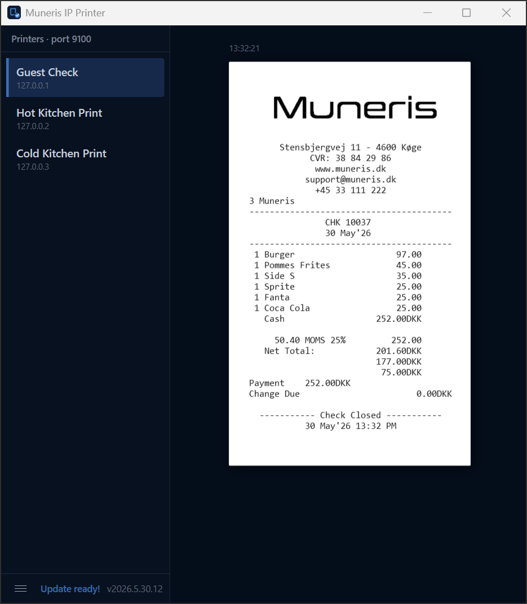
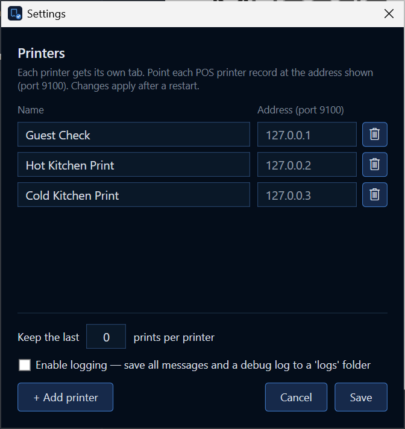
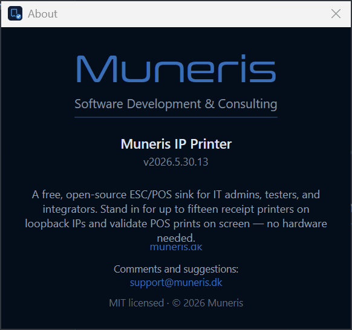

# Muneris IP Printer

A small Windows utility that listens on TCP **9100** and renders every ESC/POS
receipt on screen instead of on paper. Useful for setting up, debugging, or
demoing a POS deployment without wiring up real thermal printers.

  

## What it's for

The usual ways to test POS print output without physical printers fall short:

- **Print-to-disk** routes each receipt to a flat file. You see the text, but
  not the logo, not the QR codes, not anything graphical — and you have to
  hunt across dozens of files to compare runs.
- **Dragging a box of thermal printers** between sites works but is exactly
  as fun as it sounds.

This is the friction-free version:

- Run `MunerisIpPrinter.exe` on a workstation or test box.
- Configure the POS as if a printer existed at `127.0.0.1:9100`,
  `127.0.0.2:9100`, … (one logical printer per loopback IP, up to fifteen).
- Every receipt the POS would have printed shows up in the app, fully
  rendered — text, logos, QR codes, the lot — stacked newest-on-top per
  printer so you can scroll through a run and compare.

Typical scenarios:

- **Verifying a new Simphony venue config** — do modifiers route to the correct
  printer, do item names fit the paper, is the logo positioned right?
- **Pre-flighting a printer migration** — validate the print stream against the
  target IPs before swapping the physical printers on site.
- **Reproducing a customer's "kitchen didn't get my modifier" ticket** — bring
  up the venue config locally, replay the orders, see exactly what each
  printer would have received.

The .exe is a single file under 1 MB. Drop it in your toolkit folder
(Dropbox/OneDrive/network share), copy into any Windows box, run it. No
installer, no admin rights, no .NET runtime to install — uses the in-box
.NET Framework 4.6.2 that ships with every Windows 10+ machine.

## Install

That badge always downloads the current build. IP Printer ships as a single rolling
[**`ip-printer`** release](https://github.com/mbundgaard/MunerisTools/releases/tag/ip-printer)
that we re-point at each new version, so the download link never changes. Run it once;
the app self-registers nothing — all state lives in `%LOCALAPPDATA%\MunerisIpPrinter\`
so the .exe folder stays a single portable file.

After the first launch the app checks for newer releases every four hours and
downloads them in the background. The next time you close and reopen the app,
the new build takes over automatically. See [Auto-update](#auto-update) for details.

## Configure

Open the hamburger menu in the bottom-left of the sidebar and pick **Settings**.

  

- **Printers** — add up to 15. Each entry is automatically assigned the next
  loopback address (`127.0.0.1`, `127.0.0.2`, …) on port 9100. Use exactly that
  address in the POS printer record.
- **Keep the last N prints per printer** — set above 0 to persist receipts
  between sessions; 0 means in-memory only.
- **Enable logging** — opt-in. Dumps raw request/response bytes plus a
  `debug.log` to `%LOCALAPPDATA%\MunerisIpPrinter\logs\` for diagnostics.

Settings changes apply after a restart; the app offers to restart for you when
you save. You can rename a printer at any time by hovering its sidebar row and
clicking the pencil — renames are persisted immediately, no restart needed.

## Features

- **Up to 15 printers** on loopback IPs, each with its own scrollable history
  of receipts (newest on top).
- **Accurate ESC/POS decode** — codepage switches (`ESC t`), text, formatting,
  and `GS *` downloaded bit-image logos.
- **Per-receipt copy** — small hover-revealed icons above each rendered
  receipt. Copy as plain text (for pasting into a ticket comment) or as an
  image. The image is placed on the clipboard as both `CF_BITMAP` and `PNG`,
  so Slack, Discord, Word, and browsers all paste correctly.
- **New-print badge** — sidebar shows a count badge on any printer that's
  received receipts while you weren't looking; clears when you select it.
- **Resizable sidebar** — width is remembered across launches.
- **`GET http://localhost:9101/screenshot`** returns a PNG of the current
  window. Useful for embedding into dashboards or attaching to bug reports.
- **Auto-update from GitHub Releases** (see below).

## Auto-update

The mechanism, end to end:

1. On startup and every four hours, the app reads the single `ip-printer` release
   (`https://api.github.com/repos/mbundgaard/MunerisTools/releases/tags/ip-printer`)
   and compares its published version to the running build.
2. If it's newer, it streams the `MunerisIpPrinter.exe` asset to `%TEMP%` in the
   background.
3. When the download lands, the sidebar bottom shows **Update ready!** —
   click to apply immediately, *or* just close the app whenever you would
   anyway. On the next launch the staged file is detected and swapped in
   before any TCP port is bound.

The swap is a `Move-Item` over whatever the running exe is named, so any
shortcut you have keeps working through updates — only the file contents
change, the path doesn't.

If you'd rather check manually, the **Check for updates** entry in the
hamburger menu runs the same flow and reports "you're on the latest" otherwise.

## How it works

A quick tour of the design:

- **Listener.** One socket is bound per configured `127.0.0.X` address. Loopback-only
  listeners don't trigger Windows Defender Firewall. A retry loop on bind handles the
  brief window during a restart where the prior instance is still releasing the port.
- **ESC/POS parsing.** The byte stream is walked to emit events for cuts (`GS V`),
  responses to status queries, and logo definitions (`GS *`); receipts are split at cuts.
  Visible text is decoded honoring code-page-switch commands, and `GS * x y data` bit
  images decode to on-screen bitmaps.
- **Storage.** Settings, persisted history, and per-printer logo caches live in one file
  (`MunerisIpPrinter.bin`) under `%LOCALAPPDATA%\MunerisIpPrinter\`, organised into
  versioned slots per data type. The .exe folder stays a single portable file.
- **Auto-update.** A hand-rolled updater reads this tool's single rolling `ip-printer` release,
  compares its version to the running build, downloads the asset, and swaps it in on the next
  launch — no external dependencies, no installer.
- **Runtime.** Targets .NET Framework 4.6.2 so the same ~1 MB .exe runs on any Windows
  10+/Server 2016+ with no prerequisites.

## About

  

Built and maintained by **[Muneris](https://muneris.dk)** — software
development and consulting for hospitality POS systems.

Comments, bug reports, suggestions: **[support@muneris.dk](mailto:support@muneris.dk)**
or [open an issue](https://github.com/mbundgaard/MunerisTools/issues).

## License

MIT.
